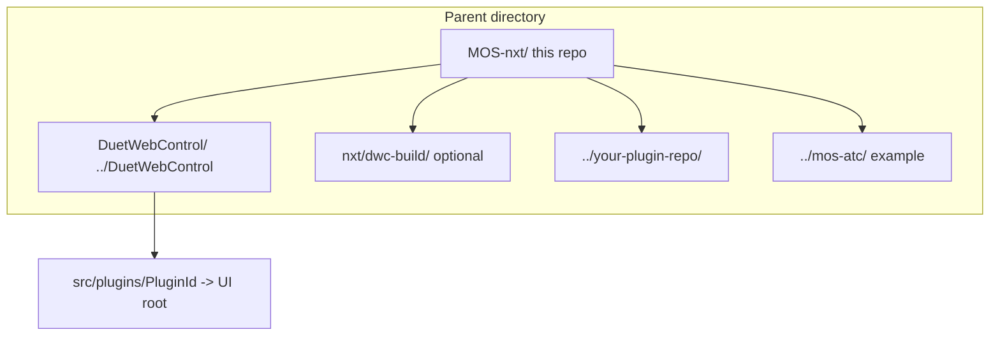

# Local plugin build and test

This guide is the operational companion for building and testing **nxt-compatible plugins** (`data.nxt.tag == "nxt-plugin"`) on a developer machine before merge or release. It covers **UI + macro** plugins (DWC plugin ZIP) and **macro-only** plugins (no Vue UI, but still need `plugin.json` and staged `sd/` macros for dispatchers).

For metadata fields, dispatcher semantics, and acceptance criteria, see [plugin-spec.md](plugin-spec.md) and [future-state-plugin-template.md](future-state-plugin-template.md).

---

## Related documentation

Several docs already cover parts of this workflow. Use this file for **directory layout**, **sibling repos**, and an **end-to-end local checklist**. Defer detail to the linked docs where noted.

| Document | What it covers | Gap for new-plugin authors |
|----------|----------------|----------------------------|
| [plugin-spec.md](plugin-spec.md) | `plugin.json` / `data.nxt`, generated dispatchers, runtime hooks | No local build paths or DWC setup |
| [future-state-plugin-template.md](future-state-plugin-template.md) | Net-new plugin metadata, macro layout, catalog fields, acceptance criteria | Requirements without step-by-step local build/test |
| [UI_DEVELOPMENT.md](UI_DEVELOPMENT.md) | **nxt core** UI: symlink, `npm run dev`, HMR, troubleshooting | Assumes `ui/` only; not generic sibling plugins |
| [README.md](../README.md) § DWC Plugin Development | nxt install + symlink quick start | Same as UI_DEVELOPMENT for core nxt |
| [PLUGIN_LOAD_TROUBLESHOOTING.md](PLUGIN_LOAD_TROUBLESHOOTING.md) | ZIP load failures (404, `dwcFiles`, version skew) | Post-build on printer, not authoring |
| [RRF_LINE_LENGTH.md](RRF_LINE_LENGTH.md) | 200-character macro line limit (boot path) | Policy; commands referenced here |
| [RRF_REFERENCE.md](RRF_REFERENCE.md) | Reference RRF version for development | Evaluation target, not install |
| [TESTING.md](TESTING.md) | Live machine `curl` workflow | **Legacy** (`millennium-os.zip`); use only for live-hardware caution |
| [BUILD.md](BUILD.md) | Legacy MillenniumOS release history | Historical; not current nxt process |
| [AGENT_KNOWLEDGE_BASE.md](../AGENT_KNOWLEDGE_BASE.md) | Third-party plugin junction lessons (e.g. MosFourthAxis) | Example gotchas; layout names may differ from current repos |

**Out of scope here (link instead):**

- Changing **nxt core** UI → [UI_DEVELOPMENT.md](UI_DEVELOPMENT.md)
- **Tagging / GitHub releases** → `dist/publish-release.sh` and release workflow rules
- **Tagged release build** (macros + post-processors + plugin ZIP for GitHub Releases) → `dist/release.sh`

---

## Directory layout

Use a **parent directory** that contains the MOS-nxt repo and sibling checkouts. Paths below are **relative to the MOS-nxt repo root** unless noted.

Example parent layout:

```
repositories/
├── MOS-nxt/                  # this repo
├── DuetWebControl/            # ../DuetWebControl (default for build scripts)
├── mos-atc/                   # ../mos-atc (catalog example, optional)
└── your-plugin-repo/          # ../your-plugin-repo (new external plugin)
```



| Path | Role | Used by |
|------|------|---------|
| **`../DuetWebControl/`** | Official DWC tree for `npm run dev` and `build-plugin` | `dist/build-plugin.sh` (default), `dist/setup-dwc-dev-symlink.sh`, `dist/verify-dwc-build-alignment.sh` |
| **`./dwc-build/`** | Pinned DWC tree from [ci/dwc-build-ref](../ci/dwc-build-ref) via `dist/ci-fetch-dwc.sh` | CI and local builds without a full git clone |
| **`../<plugin-repo>/`** | External plugin source (sibling) | [dist/plugins.catalog.json](../dist/plugins.catalog.json) `repoPath` |
| **`./ui/`** | Built-in nxt DWC plugin source | Catalog: `repoPath: "."`, `manifestPath: ui/plugin.json` |
| **`./macros/plugins/<namespace>/`** | nxt built-in plugin macros on SD | Example: `macros/plugins/next/` |
| **`./dist/`** | Build outputs (`nxt-*.zip`, post-processors, `build-version.env`) | After `build-plugin.sh` / `release.sh` |

### DWC plugin link rule

`DuetWebControl/src/plugins/<id>` must match **`plugin.json` → `id` exactly** (e.g. `nxt`, `MosAtc`). The symlink or junction target is the plugin **UI root**:

| Plugin | `plugin.json` id | Symlink target (relative to MOS-nxt root) |
|--------|------------------|----------------------------------------|
| nxt (core) | `nxt` | `./ui` → `../DuetWebControl/src/plugins/nxt` |
| MosAtc (catalog example) | (see that repo) | `../mos-atc/dwc-plugin` → `../DuetWebControl/src/plugins/<id>` |

Create the nxt core link with:

```bash
./dist/setup-dwc-dev-symlink.sh ../DuetWebControl
```

For a **new** UI plugin, mirror the same pattern: `ln -sfn "$(pwd)/../your-plugin/dwc-plugin" ../DuetWebControl/src/plugins/YourPluginId`.

### Plugin catalog

[dist/plugins.catalog.json](../dist/plugins.catalog.json) lists repos the nxt build can read for dispatcher generation:

```json
{ "id": "nxt", "repoPath": ".", "manifestPath": "ui/plugin.json", "required": true }
{ "id": "MosAtc", "repoPath": "../mos-atc", "manifestPath": "dwc-plugin/plugin.json", "required": false }
```

Add a new entry when integrating an external plugin into the main nxt build: `id`, `repoPath`, `manifestPath`, `required`.

---

## Prerequisites

### Firmware and nxt baseline

- Printer or dev board with nxt loaded (`M98 P"nxt.g"` in `config.g`). See [README.md](../README.md) installation steps.
- Reference RRF for development/review: **3.7.0-beta.1** (3.7.x line) — [RRF_REFERENCE.md](RRF_REFERENCE.md), [VERSIONING.md](VERSIONING.md).

### Reference DWC version

- Pin: [ci/dwc-build-ref](../ci/dwc-build-ref) (currently `v3.7.0-beta.1` on branch `v0.7.0`).
- Shipped plugin ZIPs set **exact** `dwcVersion` at build time; the host DWC must match (e.g. `3.7.0-beta.1`, not merely “3.7.x”).

### Tools

| Tool | Purpose |
|------|---------|
| `git` | Version branches, tags, sibling repos |
| `node` | **Node 20 LTS** recommended for DWC `npm ci` / webpack; macro checker runs on any supported Node |
| `jq` | `verify-dwc-build-alignment.sh`, manifest inspection |
| `bash` | Build scripts |
| `rsync` | Full `release.sh` only |

### DWC tree

Clone [DuetWebControl](https://github.com/Duet3D/DuetWebControl) at the tag in `ci/dwc-build-ref`, or fetch a read-only copy:

```bash
./dist/ci-fetch-dwc.sh          # → ./dwc-build/
./dist/verify-dwc-build-alignment.sh ../DuetWebControl
# or: ./dist/verify-dwc-build-alignment.sh ./dwc-build
```

---

## Plugin repository requirements

### Metadata and macros

- [plugin-spec.md](plugin-spec.md) — `data.nxt` fields, dispatchers, load semantics.
- [future-state-plugin-template.md](future-state-plugin-template.md) — macro naming, catalog fields, acceptance criteria.

**Required:**

- `plugin.json` with `data.nxt.tag: "nxt-plugin"` and `data.nxt.entrypoints.init` (path under `0:/sys/`, e.g. `plugins/my-plugin/my-plugin-init.g`).
- Init macro on SD (staged as `sd/sys/plugins/...` in the ZIP).
- Optional: daemon, pause, resume, stop, cancel entrypoints and macros.

**UI plugins additionally need:**

- Plugin root: `index.ts` or `index.js`, `plugin.json` at UI root.
- `dwcWebpackChunk` in `plugin.json` must match `id`.
- For symlinked dev: a `tsconfig.json` at the UI root (copy/adapt from [ui/tsconfig.json](../ui/tsconfig.json)) so `ts-loader` resolves `@/*` via the DWC tree.

**Macro-only plugins:**

- Minimal `plugin.json` (no Vue sources) is enough for dispatcher generation if macros are staged under `sd/sys/`.
- Build still produces a DWC-installable ZIP if you include only `sd/` members (PollConnector installs `sd/*` to `0:/sys/`).

### Macro line length (mandatory before build)

RRF rejects long lines during boot (`GCode command too long`). Non-comment macro lines must be **≤ 200 characters**:

```bash
node dist/check-gcode-line-length.mjs
```

See [RRF_LINE_LENGTH.md](RRF_LINE_LENGTH.md). Do not rely on `dist/check-macro-line-length.sh` alone (255-char limit); release builds use the 200-char checker.

---

## Registering a new plugin in nxt

When your plugin ships with or through the main MOS-nxt repo:

1. Add an entry to [dist/plugins.catalog.json](../dist/plugins.catalog.json).
2. Place macros either:
   - In the external repo under paths referenced by `data.nxt.entrypoints` (staged into `sd/sys/` at build), or
   - Under `macros/plugins/<namespace>/` in nxt if co-located.
3. Dispatcher files are generated at build time under `sd/sys/nxt/plugins/`:
   - `nxt-plugin-init-dispatch.g`
   - `nxt-plugin-daemon-dispatch.g`
   - `nxt-plugin-hooks-*.g`

`dist/build-plugin.sh` and `dist/release.sh` invoke `dist/generate-plugin-dispatchers.sh` when the catalog exists.

---

## Local build workflows

### A. DWC hot-reload dev (UI plugins)

From the **MOS-nxt repo root**:

```bash
./dist/setup-dwc-dev-symlink.sh ../DuetWebControl
cd ../DuetWebControl
npm run dev
```

Open `http://localhost:8080/`. First time: cancel connect dialog → **Settings → Plugins → Start** your plugin → connect to the machine or work disconnected.

**Caveat:** `./dist/build-plugin.sh` removes `src/plugins/<Id>` from the DWC tree. Re-run `setup-dwc-dev-symlink.sh` after a production build. See [UI_DEVELOPMENT.md](UI_DEVELOPMENT.md) troubleshooting.

For **nxt core UI only**, follow [UI_DEVELOPMENT.md](UI_DEVELOPMENT.md) in full.

### B. Production plugin ZIP (install test)

From the **MOS-nxt repo root** (builds core nxt plugin + staged nxt macros):

```bash
./dist/verify-dwc-build-alignment.sh ../DuetWebControl
./dist/build-plugin.sh ../DuetWebControl
```

Output: `dist/nxt-<ref>-<sha>[-dirty].zip` (local branch builds) or `dist/nxt-<version>.zip` (tag/release resolution).

Verify the ZIP before installing:

```bash
node dist/verify-plugin-zip.mjs dist/nxt-*.zip
```

Install on the printer: **Settings → Plugins → Install Plugin** → upload the ZIP → **Start**.

**External plugin only:** `build-plugin.sh` stages a temp tree with `plugin.json` and copies nxt `macros/` into `sd/sys/`. For a standalone external repo, either:

- Add it to the catalog and extend the build to stage that repo’s `sd/` (integration path), or
- Prepare a staging directory with `plugin.json` + `sd/sys/plugins/...` and pass it to DWC’s `npm run build-plugin <staging-dir>` after patching per `dist/patch-dwc-build-plugin-zip.cjs` (same as nxt’s internal flow). External repos should mirror the MosAtc layout: `dwc-plugin/` (UI) + macros under `sd/` or a repo-specific `macros/` tree merged at build time.

### C. Pinned DWC without cloning

```bash
./dist/ci-fetch-dwc.sh
./dist/verify-dwc-build-alignment.sh ./dwc-build
./dist/build-plugin.sh ./dwc-build
```

---

## Local testing matrix

| Layer | What to verify | How |
|-------|----------------|-----|
| **Metadata** | Required `data.nxt` fields | Compare to [plugin-spec.md](plugin-spec.md); catalog entry if integrated |
| **Macros** | Line length, entrypoints exist | `node dist/check-gcode-line-length.mjs`; paths match `data.nxt.entrypoints` |
| **Dispatchers** | Generated dispatchers list your plugin | Inspect `sd/sys/nxt/plugins/nxt-plugin-*-dispatch.g` in build staging or on SD after install |
| **UI (dev)** | Compiles, plugin starts | `npm run dev`, browser console, **Settings → Plugins** |
| **UI (ZIP)** | Flat `dwc/js/`, `dwcFiles` | `node dist/verify-plugin-zip.mjs dist/nxt-*.zip`; [PLUGIN_LOAD_TROUBLESHOOTING.md](PLUGIN_LOAD_TROUBLESHOOTING.md) |
| **Printer** | ZIP installs, exact `dwcVersion` | Reinstall ZIP; hard-refresh browser; smoke-test panels |
| **Firmware** | Init once per boot | `global.nxtPluginLoaded_*` per [plugin-spec.md](plugin-spec.md) |

### Manual sign-off

Before tagging or publishing a plugin ZIP, confirm it **loads and runs** on a printer whose DWC version **exactly matches** the built `plugin.json` `dwcVersion`. CI success alone is not sufficient (see release rules in the repo).

### Live hardware

If you move axes or spindles during testing, follow caution in [TESTING.md](TESTING.md) (legacy package names there; the safety rules still apply). Plugin ZIP install does not replace nxt firmware install on SD — ensure `nxt.g` is already in `config.g`.

---

## Common failures

| Symptom | Likely cause | Fix |
|---------|--------------|-----|
| Plugin not in DWC list | Missing symlink or `imports.ts` | `setup-dwc-dev-symlink.sh`; `node dist/regenerate-dwc-plugin-imports.cjs ../DuetWebControl` |
| `can't access property "call"` on Start | 404, empty `dwcFiles`, or DWC version skew | [PLUGIN_LOAD_TROUBLESHOOTING.md](PLUGIN_LOAD_TROUBLESHOOTING.md); rebuild with aligned DWC |
| PR checks pass, release fails macros | 255-char CI vs 200-char release | `node dist/check-gcode-line-length.mjs` before push |
| Wrong URLs under `/nxt/js/` | Nested `dwc/nxt/js/` in ZIP | Rebuild; `node dist/fix-plugin-dwc-zip-layout.cjs` if needed |
| Init macro never runs | Not tagged `nxt-plugin` or dispatchers not deployed | Regenerate dispatchers; confirm `nxt.g` runs on boot |
| Build removed dev plugin | `build-plugin.sh` deletes `src/plugins/<Id>` | Re-run symlink script |

---

## Windows notes

- Use `mklink /J` for junctions; folder name **must** match `plugin.json` `id` (see [README.md](../README.md)).
- PowerShell build helper: [dist/build-plugin-win.ps1](../dist/build-plugin-win.ps1) (nxt core plugin; re-run junction after build).

---

## Optional: external repo branch helper

[dist/sync-external-plugin-branch.sh](../dist/sync-external-plugin-branch.sh) creates a sync branch in a sibling plugin repo (`sync/next-plugin-loader-<id>-<sha>`). Not required for first local test.

---

## Quick reference

```bash
# Macro gate (from MOS-nxt repo root)
node dist/check-gcode-line-length.mjs

# DWC pin
./dist/verify-dwc-build-alignment.sh ../DuetWebControl

# Dev symlink (nxt core)
./dist/setup-dwc-dev-symlink.sh ../DuetWebControl
cd ../DuetWebControl && npm run dev

# Plugin ZIP
./dist/build-plugin.sh ../DuetWebControl
node dist/verify-plugin-zip.mjs dist/nxt-*.zip
```
