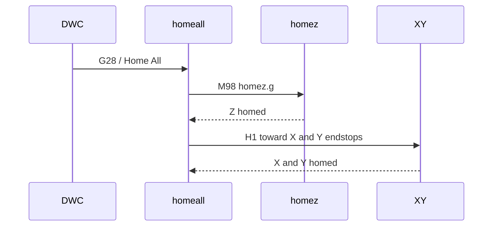

# NeXT board homing requirements

RRF uses homing macros on the SD card root:

| File | Role |
|------|------|
| `0:/sys/homez.g` | Home Z only |
| `0:/sys/homex.g` | Home X (lifts Z first) |
| `0:/sys/homey.g` | Home Y (lifts Z first) |
| `0:/sys/homeall.g` | Home all — **Z first**, then X and Y together |

NeXT vendors homing sources under `0:/sys/nxt-config/machine/<profile>/` and deploys them from **Configuration → Apply platform sys files**. They are **not** loaded by `nxt.g` at boot (deploy-only).

Board + machine packs load via `nxt-board-pack-loader.g` (drives, limits, pins).

## homeall sequence

## Requirements matrix

| Machine | Axis | Travel / endstop | machine/limits + endstop-y | machine/steps, drives-z | Post-home |
|---------|------|------------------|----------------------------|-------------------------|-----------|
| **v1.5** | X | Toward **min** | `M574 X1` (board pins) | — | — |
| **v1.5** | Y | Toward **max** | `M574 Y2` via `endstop-y.g` | — | — |
| **v1.5** | Z | Toward **max** (top) | `M574 Z2` | `M569 P2 S0`, `M92 Z1600` | `G92 Z{move.axes[2].max}` |
| **v1.6_v2** | X | Toward **min** | `M574 X1` | — | — |
| **v1.6_v2** | Y | Toward **min (Y0)** | `M574 Y1` via `endstop-y.g` | — | — |
| **v1.6_v2** | Z | Toward **max** (top) | `M574 Z2` | `M569 P2 S1`, `M92 Z800` | `G92 Z{move.axes[2].max}` |

Source files:

- v1.5: `macros/nxt-config/machine/v1.5/home*.g`
- v1.6_v2: `macros/nxt-config/machine/v1.6_v2/home*.g`

## Deploy workflow

1. Install or update the NeXT plugin (ships `nxt-config/machine/<profile>/` on SD).
2. In DWC **Configuration**, select **Machine profile** (`v1.5` or `v1.6_v2`).
3. Review deploy list (homing → `0:/sys/`, board/machine boot paths).
4. Click **Apply platform sys files**.
5. Files in `machine/<profile>/sys-deploy-manifest.txt` upload to `0:/sys/`, replacing existing `home*.g`.

## Tuning

1. Edit homing under `macros/nxt-config/machine/<profile>/` in the NeXT repo.
2. Keep `board/.../endstops.g` and `machine/.../endstop-y.g` consistent with travel direction.
3. Run `node dist/generate-nxt-config-manifest.mjs` and reinstall the plugin ZIP.
4. **Apply platform sys files** again on the machine.

## See also

- [NXT_BOARD_CONFIG.md](NXT_BOARD_CONFIG.md)
- [CONFIGURATION_UI.md](CONFIGURATION_UI.md)
