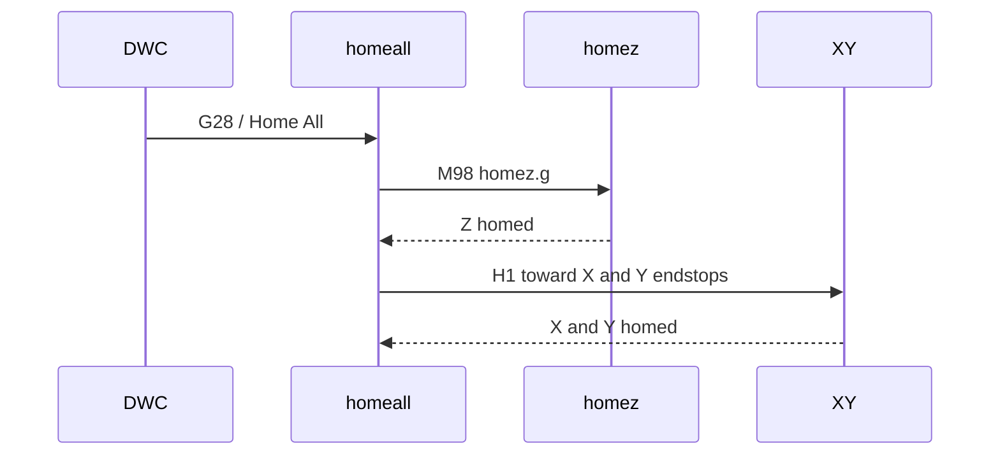

# NeXT board homing requirements

RRF uses homing macros on the SD card root:

| File | Role |
|------|------|
| `0:/sys/homez.g` | Home Z only |
| `0:/sys/homex.g` | Home X (lifts Z first) |
| `0:/sys/homey.g` | Home Y (lifts Z first) |
| `0:/sys/homeall.g` | Home all — **Z first**, then X and Y together |

NeXT vendors these under `0:/sys/nxt/config/<platform>/common/` and deploys them from the **Configuration** panel (**Apply platform sys files**). Pack `entry.g` chains load drives/limits/spindle separately via `nxt-board-pack-loader.g`.

## homeall sequence



## Requirements matrix

| Platform | Axis | Travel / endstop | Pack `limits.g` | Pack `drives.g` | Post-home |
|----------|------|------------------|-----------------|-----------------|-----------|
| **v1.5** | X | Toward **min** | `M574 X1` | — | — |
| **v1.5** | Y | Toward **max** | `M574 Y2` | — | — |
| **v1.5** | Z | Toward **max** (top) | `M574 Z2` | `M569 P2 S0`, `M92 Z1600` | `G92 Z{move.axes[2].max}` |
| **v1.6_v2** | X | Toward **min** | `M574 X1` | — | — |
| **v1.6_v2** | Y | Toward **min (Y0)** | `M574 Y1` | — | — |
| **v1.6_v2** | Z | Toward **max** (top), reversed drive | `M574 Z2` | `M569 P2 S1`, `M92 Z800` | `G92 Z{move.axes[2].max}` |

Source files:

- v1.5: `macros/nxt-config/v1.5/common/home*.g` (baseline from [Millennium RRF-Configs milo-v1.5/common](https://github.com/MillenniumMachines/RRF-Configs/tree/main/milo-v1.5/common))
- v1.6_v2: `macros/nxt-config/v1.6_v2/common/home*.g` (Y and Z homing signs corrected for v1.6 / v2.0 mechanics)

## Deploy workflow

1. Install or update the NeXT plugin (ships `nxt/config/<platform>/common/` on SD).
2. In DWC **Configuration**, select **Platform** (e.g. `v1.5` or `v1.6_v2`).
3. Review the file list under **Platform bundle on SD**.
4. Click **Apply platform sys files** (or confirm when changing platform).
5. Files listed in `common/sys-deploy-manifest.txt` are uploaded to `0:/sys/`, **replacing** any existing `homeall.g`, `homex.g`, `homey.g`, `homez.g`.

Manifest example (`v1.5/common/sys-deploy-manifest.txt`):

```
homeall.g
homex.g
homey.g
homez.g
```

## Tuning

1. Edit homing macros under `macros/nxt-config/<platform>/common/` in the NeXT repo.
2. Keep `limits.g` / `drives.g` in that platform’s `boards/` tree consistent with travel direction and steps/mm.
3. Rebuild/reinstall the plugin ZIP.
4. **Apply platform sys files** again on the machine.

Probe repeatability (G6512) is **not** in these files — see `nxt-vars.g` and optional `nxt-user-overrides.g`.

## Verification checklist

| Step | v1.5 | v1.6_v2 |
|------|------|---------|
| Apply sys files | Confirm `0:/sys/homey.g` uses **positive** `H1 Y{…}` toward max | Confirm **negative** `H1 Y{…}` toward min |
| Home Y | Carriage moves to **Y max** endstop | Carriage moves to **Y0** / min endstop |
| Home Z | Moves up; Z=0 at top | Same with reversed motor command signs |
| After pack load | `M92 Z` → **1600** | `M92 Z` → **800** |

If an axis runs the wrong way, fix **both** the homing macro signs and `M574` / `M569` in the board pack, then redeploy.

## See also

- [NXT_BOARD_CONFIG.md](NXT_BOARD_CONFIG.md) — directory layout, pack loader, platform discovery
- [CONFIGURATION_UI.md](CONFIGURATION_UI.md) — Configuration panel board section
