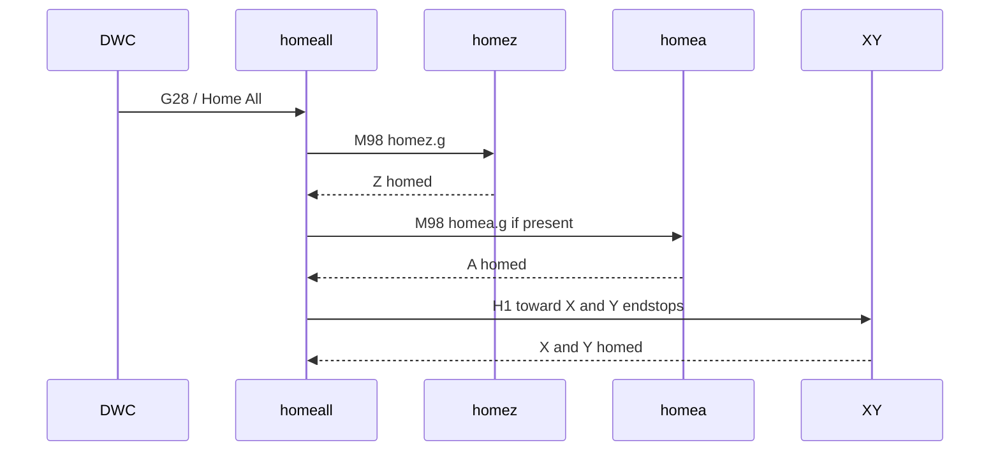

# nxt board homing requirements

RRF uses homing macros on the SD card root:

| File | Role |
|------|------|
| `0:/sys/homez.g` | Home Z only |
| `0:/sys/homex.g` | Home X (lifts Z first) |
| `0:/sys/homey.g` | Home Y (lifts Z first) |
| `0:/sys/homea.g` | Home A (optional; Custom Save or MosFourthAxis) |
| `0:/sys/homeall.g` | Home all — **Z**, then **A if present**, then **X and Y together** |

nxt vendors homing sources under `0:/sys/nxt-config/machine/<profile>/` and deploys them from **Configuration → Apply platform sys files**. They are **not** loaded by `nxt.g` at boot (deploy-only).

Board + machine packs load via `nxt-board-pack-loader.g` (drives, limits, pins).

## homeall sequence

A runs **before** XY so the rotary is at a known/safe position before the table moves. Presence of `0:/sys/homea.g` is the gate (not a firmware feature flag in the macro).

## Requirements matrix

| Machine | Axis | Travel / endstop | machine/limits + endstops.g | machine/steps, drives-dir.g | Post-home |
|---------|------|------------------|-----------------------------|-----------------------------|-----------|
| **v1.5** | X | Toward **min** | `M574 X1` via `endstops.g` | `M569 P0 S1` | — |
| **v1.5** | Y | Toward **max** | `M574 Y2` via `endstops.g` | `M569 P1 S1` | — |
| **v1.5** | Z | Toward **max** (top) | `M574 Z2` via `endstops.g` | `M569 P2 S0`, `M92 Z1600` | `G92 Z{move.axes[2].max}` |
| **v1.6** | X | Toward **min** | `M574 X1` via `endstops.g` | `M569 P0 S1` | — |
| **v1.6** | Y | Toward **min (Y0)** | `M574 Y1` via `endstops.g` | `M569 P1 S1` | — |
| **v1.6** | Z | Toward **max** (top) | `M574 Z2` via `endstops.g` | `M569 P2 S1`, `M92 Z800` | `G92 Z{move.axes[2].max}` |
| **v2.0-milo** | X | Toward **min** (moving table) | `M574 X1` via `endstops.g`, `M208 X335` | `M569 P0 S1` | — |
| **v2.0-milo** | Y | Toward **min (Y0)** | `M574 Y1` via `endstops.g` | `M569 P1 S1` | — |
| **v2.0-milo** | Z | Toward **max** (top) | `M574 Z2` via `endstops.g` | `M569 P2 S1`, `M92 Z800` | `G92 Z{move.axes[2].max}` |
| **v2.0-miley** | X | Toward **max** (stationary X) | `M574 X2` via `endstops.g`, `M208 X308` | `M569 P0 S1` | — |
| **v2.0-miley** | Y | Toward **min (Y0)** | `M574 Y1` via `endstops.g` | `M569 P1 S1` | — |
| **v2.0-miley** | Z | Toward **max** (top) | `M574 Z2` via `endstops.g` | `M569 P2 S1`, `M92 Z800` | `G92 Z{move.axes[2].max}` |
| **custom** | X/Y/Z (+A optional) | Direction from `nxtCustom*HomeAt` (1=min→neg, 2=max→pos) | `nxtCustom*` → `M208` / `M574` / overlay in `0:/sys/nxt-user-custom/` | `M92` / `M584` / `M569` / `M906` via overlay | `G92` to min or max per axis; `homea.g` when A configured; **homeall** calls A **before** XY |

Source files:

- v1.5: `macros/nxt-config/machine/v1.5/home*.g`
- v1.6: `macros/nxt-config/machine/v1.6/home*.g`
- v2.0-milo: `macros/nxt-config/machine/v2.0-milo/home*.g`
- v2.0-miley: `macros/nxt-config/machine/v2.0-miley/home*.g`
- custom: generated `0:/sys/home*.g` on Save; stock stubs under `macros/nxt-config/machine/custom/`

Legacy id `v1.6_v2` still loads the v1.6 pack at boot (one-release alias).
Legacy id `v2.0` still loads the v2.0-milo pack at boot (one-release alias).

## Deploy workflow

1. Install or update the nxt plugin (ships `nxt-config/machine/<profile>/` on SD).
2. In DWC **Configuration**, select **Machine profile** (`v1.5`, `v1.6`, `v2.0-milo`, `v2.0-miley`, or `custom`).
3. Review deploy list (homing → `0:/sys/`, board/machine boot paths).
4. Click **Apply platform sys files**.
5. Files in `machine/<profile>/sys-deploy-manifest.txt` upload to `0:/sys/`, replacing existing `home*.g`.

## Tuning

1. Edit homing under `macros/nxt-config/machine/<profile>/` in the MOS-nxt repo.
2. Keep board pin map and `machine/.../endstops.g` / `drives-dir.g` consistent with travel direction.
3. Run `node dist/generate-nxt-config-manifest.mjs` and reinstall the plugin ZIP.
4. **Apply platform sys files** again on the machine.

## See also

- [NXT_BOARD_CONFIG.md](NXT_BOARD_CONFIG.md)
- [CONFIGURATION_UI.md](CONFIGURATION_UI.md)
