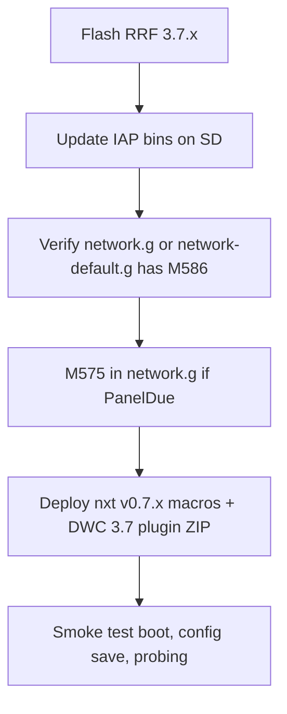

# RRF 3.7 migration (nxt on branch `v0.7.0`)

Guide for operators and maintainers moving from **RRF 3.6.x + nxt v0.6.x** to **RRF 3.7.x + nxt v0.7.x**.

**Status:** Active on branch **`v0.7.0`**. See [VERSIONING.md](VERSIONING.md) for branch ↔ firmware alignment.

**Upstream changelog:** [RepRapFirmware changes from 3.6.3 to 3.7.0-beta.1](https://github.com/Duet3D/RepRapFirmware/wiki/Changelog-RRF-3.x-Beta#reprapfirmware-changes-from-363-to-370-beta1)

**Reference pins (this branch):** RRF/DWC evaluation **3.7.0-beta.1** — [`ci/dwc-build-ref`](../ci/dwc-build-ref), [RRF_REFERENCE.md](RRF_REFERENCE.md).

---

## Upgrade checklist

1. Flash **RRF 3.7.x** on the main board.
2. Upload new **IAP** files to SD (`Duet3_SDiap32_*.bin` for your board). New IAP works with 3.6.x too; required for future 3.7 upgrades.
3. **Verify HTTP** is enabled (see [Network configuration](#network-configuration-m586) below). RRF 3.7 disables HTTP by default.
4. If you use **PanelDue** on the first serial port, update **M575** (see [Serial / PanelDue](#serial--paneldue-m575)).
5. Install **nxt v0.7.x** macros on SD and the **plugin ZIP** built against **matching DWC 3.7.x** (exact `dwcVersion` in `plugin.json`).
6. Smoke-test: `nxt.g` boot (`global.nxtLoaded`), Configuration save, probing cycle.



---

## Network configuration (`M586`)

RRF **3.7** does not enable HTTP by default. Duet Web Control and nxt Configuration panel saves (`rr_upload`) need HTTP (or HTTPS/TLS per upstream docs).

### Do not blanket-edit `config.g`

nxt does **not** ship a root `config.g`. For stock **Milo** installs with board-pack bootstrap, HTTP is configured in the **machine pack** network chain:

```
config.g → M98 P"nxt.g"
  → nxt-board-pack-loader.g (when nxt-board-bootstrap.requested exists)
  → machine/<profile>/entry.g
       → if 0:/sys/network.g exists: M98 P"network.g"
       → else: M98 P"nxt-config/machine/<profile>/network-default.g"
```

**Vendored defaults** ([`network-default.g`](../macros/nxt-config/machine/v1.5/network-default.g) for `v1.5`, `v1.6`, `v2.0`, and `custom`) already include (standalone only):

```gcode
if { exists(sbc) }
    M99           ; SBC: DSF owns networking — skip M552/M586
M552 S2           ; WiFi AP mode
M586 P0 S1        ; HTTP enabled (required on RRF 3.7+)
M586 P1 S0        ; FTP disabled
```

On **SBC mode**, `M552`/`M586` in `config.g` / machine packs error (networking is on the Pi via DSF). The default file detects `exists(sbc)` and returns without those codes. Configure the Pi hostname/network via DuetPi / `dsf-config.g` instead.

Machine packs also skip **`M550`** (machine name) when `exists(sbc)` — put display name / hostname changes in **`dsf-config.g`** (or raspi-config), not in `general.g`.

Board packs (Scylla, etc.) do **not** configure network. Fly CDYv3 packs are not shipped on the RRF 3.7 line.

| Install path | HTTP on 3.7? | Action |
|--------------|--------------|--------|
| Milo + bootstrap Auto + **no** `0:/sys/network.g` (standalone) | Covered by `network-default.g` | None if machine pack loads at boot |
| **SBC mode** (DSF) | Served by DSF on the Pi | `network-default.g` skips `M552`/`M586`; do not put them in `config.g` |
| User has **`0:/sys/network.g`** on SD | Unknown — overrides default | Audit/add `M586 P0 S1` (and `M586 P2` if using HTTPS) in **your** `network.g` (standalone only) |
| Bootstrap skipped (`nxt-board-bootstrap.skip` or never requested) | Machine pack (and `network-default.g`) not loaded | Enable HTTP in `config.g`, `network.g`, or `user-config.g` |
| Ethernet-only (no WiFi AP) | Custom setup | Custom `network.g` with appropriate `M552`/`M586` — still need explicit `M586 P0 S1` on 3.7 |

See [NXT_BOARD_CONFIG.md](NXT_BOARD_CONFIG.md#network-configuration) for boot order. The Configuration UI does **not** deploy `network.g` (only homing via sys-deploy).

---

## Serial / PanelDue (`M575`)

Duet 3 main boards expose **two USB CDC channels** in RRF 3.7. In `M575`, device **1** is the second USB CDC; device **2** is the first serial port; device **3** is the second serial port.

**PanelDue / serial screens:** If you use a screen on the Scylla UART header (PD8/PD9), prefer Configuration → **UART accessory** (`nxtUartDevice` + board `uart.g`) rather than hand-editing `network.g`. Manual `M575` in user config remains valid; on 3.7.x aux2 is typically **P3** (see nxt `uart.g`). Legacy note: first serial PanelDue was often `M575 P1` on 3.6.x → **P2** on 3.7 for the first UART — confirm which port your cable uses.

Dual-boot between 3.6.x and 3.7.x (from upstream wiki):

```gcode
if take(boards[0].firmwareVersion,3) = "3.6"
  M575 P1 B57600 S4                  ; PanelDue on first serial (3.6.x)
else
  M575 P2 B57600 S4                  ; PanelDue on first serial (3.7.x)
```

**PanelDue firmware:** upgrade to **3.7.0+** for bed/chamber heater display (OM changes). 3.7 PanelDue firmware is backward-compatible with 3.6.x RRF.

---

## Machine / platform changelog (operator)

| Change | nxt relevance | Action |
|--------|---------------|--------|
| HTTP disabled by default | High for DWC | See [Network](#network-configuration-m586) |
| M575 serial numbering | Medium if PanelDue | User `network.g` / `config.g` |
| IAP file updates (Duet 3) | Required | Upload new IAP bins to SD |
| PanelDue ≥ 3.7.0 | Low for CNC-only DWC users | Upgrade PanelDue if attached |
| Duet 2 dropped | nxt targets Duet 3 CNC | Out of support |
| Fly CDYv3 (`cdy3_f4`) dropped | Not supported on RRF 3.7 | Select Scylla 24/48 V; re-save board in Configuration |
| Duet 3 Mini: multi motion systems removed | Low | Note only unless your config uses it |
| M408 withdrawn | None | nxt does not use M408 |

---

## Meta G-code / macros

Cross-reference: [CODE.md](CODE.md), [RRF_META.txt](RRF_META.txt), [RRF_LINE_LENGTH.md](RRF_LINE_LENGTH.md).

### Expression semantics (3.7)

RRF 3.7 returns `false`/`null` instead of errors in some cases:

- `exists(E[n])` when `E` is not an array → `false`
- `exists(#E)` when `E` is not an array → `false`
- `exists(E.f)` when `E` is not an object → `false`
- `E[n]`, `#E`, `E.f` when `E` is `null` → `null`

**nxt impact:** Low. Macros use `exists(global.*)` with `&& … != null` guards. Do **not** rely on expression errors as control flow.

**Applied in nxt v0.7.0 macros:** Probe cycles (`G650x`/`G6520`) initialize `nxtProbeResults` slots with `== null || #…` before `#` on a possibly-null row. Callable user M/G macros received `inputs[state.thisInput].active` checks where missing (`G6512`, `M80.9`, `M81.9`). **Do not** add this guard to `tpre`/`tfree`/`tpost` — RRF runs those for tool changes and they must always execute.

### `^` operator — array vs string concatenation

In 3.7, `e1 ^ e2` concatenates **arrays** when both operands are arrays (3.6 coerced both to strings).

**nxt impact:** Low for message building. **Critical for math:** `^` is **never** exponentiation — `(dx)^2` inside `sqrt` yields `missing expected numeric operand`. Use `dx * dx` or `pow(dx, 2)`. See [RRF_META_PITFALLS.md](RRF_META_PITFALLS.md).

**nxt usage:** `^` almost exclusively for **string** `echo`/`abort`/`M291` messages. Do not use `^` between two array expressions; build strings element-wise (see `nxt-mos-import.g`). Gate: `node dist/check-rrf-caret-power.mjs`.

### Array literals `[ ]` vs `{ }`

RRF 3.7 prefers `[a, b, c]`; `{ }` still works.

**nxt policy:** Stay on `{ }` and `{ vector(...) }` per [RRF_META.txt](RRF_META.txt) for compatibility within the 3.7 line. Do not mass-convert macros to `[ ]`.

### Other macro notes

- **G68** per motion system — landed in 3.6.2; [M6520.g](../macros/utilities/M6520.g) unchanged for 3.7.
- **M581.1** — OM expression triggers (informational; not used by nxt today).
- Richer error messages (filename + line) — helps debugging; no nxt change.

---

## Object model vs nxt DWC plugin

| OM change | nxt usage | Action |
|-----------|-----------|--------|
| `heat.bedHeaters` / `chamberHeaters` → `bedHeaterMapping` / `chamberHeaterMapping` | Not used in `ui/` | None for base nxt |
| Kinematics names (`delta` → `linearDelta`, etc.) | Not used in `ui/` | None for CNC cartesian |
| `move.motionSystems[]`; legacy `move`/`state` fields obsolete | Plugin uses `state.currentTool` | No immediate change; prefer `move.motionSystems[n].currentTool` in new code if multi-system matters |
| `move.extruders[].pressAdv` | CNC — not used | N/A |

---

## DWC plugin (critical)

Shipped ZIPs set **exact** `dwcVersion` at build (`ui/plugin.json` `dwcVersion: "auto"`).

- A **3.6.x-built ZIP will not load** on a **3.7.x** DWC host. See [PLUGIN_LOAD_TROUBLESHOOTING.md](PLUGIN_LOAD_TROUBLESHOOTING.md).
- DWC **3.7** builds plugins with **Vite** (IIFE + flat `dwc/js|css`, filenames `nxt-<hash>.*`). nxt `dist/build-plugin.sh` / `release.sh` detect Vite vs webpack and no longer require the old webpack chunk-filter patch for 3.7.
- **Build host Node:** DWC 3.7 `rolldown` requires **Node ^20.19 or ≥22.12** (22 LTS recommended). Ubuntu/system **Node 18** fails with `styleText` missing from `node:util`. Run `./dist/check-node-for-dwc-build.sh` (also invoked by `build-plugin.sh`).
- Build on branch `v0.7.0` against the pin in [`ci/dwc-build-ref`](../ci/dwc-build-ref):

```bash
./dist/ci-fetch-dwc.sh                    # optional: fetch pinned DWC
./dist/verify-dwc-build-alignment.sh ./dwc-build
./dist/build-plugin.sh ./dwc-build
```

**UI port status:** nxt UI on `v0.7.0` uses Vue 3 / Pinia via `ui/src/compat/dwcStore.ts` and `@/plugins` registration (`registerRoute`, `registerPluginMessages`). Treat remaining Options-API / Vuetify polish as follow-ups, not a blocker for ZIP packaging.

Host DWC patch must match the ZIP’s `plugin.json` `dwcVersion` **exactly** (e.g. `3.7.0-beta.1`).

`rrfVersion: "auto-major"` accepts **3.7.*** RRF once the plugin matches DWC.

### ArborCTL (optional sibling plugin)

ArborCTL is listed in [`dist/plugins.catalog.json`](../dist/plugins.catalog.json) (`../ArborCTL`). Install the **ArborCTL** DWC ZIP (built against the same DWC 3.7 pin) so `0:/sys/plugins/arborctl/*` and `0:/sys/arborctl/` exist. Spindle polling runs via the generated daemon dispatcher — not a hard-coded call in `daemon.g`.

---

## Maintainer checklist (branch `v0.7.0`)

| Item | Status / notes |
|------|----------------|
| `ci/dwc-build-ref` → 3.7.x | `v3.7.0-beta.1` until stable 3.7.0 ships |
| [VERSIONING.md](VERSIONING.md) | Branch ↔ RRF policy |
| [RRF_REFERENCE.md](RRF_REFERENCE.md) | Evaluation RRF 3.7.x |
| Probe result null guards + motion-system `M99` | ✅ in macros (see Meta G-code section above) |
| Macro audit: `^` between arrays | Low priority grep — none found |
| **Build Node ≥20.19 / ≥22.12** | ✅ gate: `dist/check-node-for-dwc-build.sh` (Node 18 → `styleText` failure) |
| **DWC Vite plugin builder** | ✅ `detect-dwc-plugin-builder.mjs` + staging-dir ZIP path |
| **Vue 3 / Pinia UI registration** | ✅ `@/plugins` + `compat/dwcStore` (not Vue 2 `@/store` / `@/routes`) |
| **Exact `dwcVersion` ZIP** | Rebuild against pin; host must match exactly |
| **RRF HTTP (`M586 P0 S1`)** | Required on 3.7 for DWC / config upload |
| Hardware sign-off before release tag | Required per release gates |

### 3.7 validation checklist (build + load)

Use this when a local build fails or before tagging:

- [ ] `which node` / `node -v` is **not** system Node 18 (`./dist/check-node-for-dwc-build.sh` exits 0)
- [ ] Sibling DWC (or `./dwc-build`) matches `ci/dwc-build-ref` (`verify-dwc-build-alignment.sh`)
- [ ] `node dist/check-gcode-line-length.mjs` exits 0
- [ ] `./dist/build-plugin.sh ../DuetWebControl` exits 0 **without** `NXT_SKIP_DWC_TYPECHECK` (unless debugging packaging only)
- [ ] ZIP `plugin.json` `dwcVersion` equals host DWC (e.g. `3.7.0-beta.1`)
- [ ] Install ZIP → Start plugin → **Control → nxt** routes appear (Vue 3 registration)
- [ ] Smoke: Tool Library / guided probing / RGB Save / Maintenance as applicable
- [ ] Printer RRF is **3.7.x** with HTTP enabled

---

## See also

- [VERSIONING.md](VERSIONING.md) — `v0.7.0` ↔ RRF 3.7 alignment
- [RRF_REFERENCE.md](RRF_REFERENCE.md) — evaluation target on this branch
- [NXT_BOARD_CONFIG.md](NXT_BOARD_CONFIG.md) — board/machine pack boot order
- [LOCAL_PLUGIN_BUILD_AND_TEST.md](LOCAL_PLUGIN_BUILD_AND_TEST.md) — Node / Vite build layout